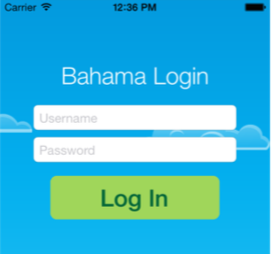
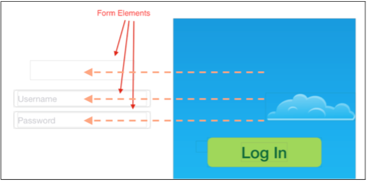
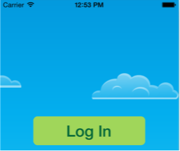
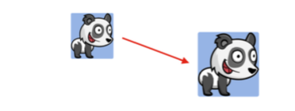

# 第一章：View动画初体验
在这一章，你降探索动画效果无底的界限。然后，请不要被本章的名称迷惑了：从如此强大和丰富的API开始意味着有大量的精彩片段去探索！

在这一章和其附带的练习工程，你将学到如下知识：
* 为酷效设置舞台
* 创建移动和淡入淡出效果
* 调整动画位置
* 翻转和重复动画

这个过程中将要通过一堆生疏概念，但是，我保证会很有趣，你准备好接受挑战了么？

好了，现在开始吧。

## 第一个动画
打开本章对应的资源文件夹里面的开始工程（译者注：BahamaAir-Starter 目录）。构建并运行这个Xcode工程；将会
看到一个虚构的航空公司的登录界面，如下这样：

这个app现在还没有太多功能： 只展示了一个带有一个标题和两个输入框登录表格以及一个大大的按钮。

除此之外还有一个漂亮的背景图片和四朵云。这几朵云已经连接到代码中的outlet变量了。

打开 *ViewController.swift* 看下，在文件的开头你将看到连接的outlets和类成员变量。再往下 看`viewDidLoad()`里面的一些初始化UI的代码，现在的工程已经准备好接下来的动画效果做改造了！

毫无疑问，通过上面的介绍，你已经准备好修改代码来查看效果了。

你的首要任务就是当用户打开应用时，将这个表单动态的呈现出来。由于现在这个App一打开的时候，就可以看到表单，因此首先要将这些元素移动到屏幕外面。

先在`viewWillAppear()`里面添加如下代码：

	heading.center.x -= view.bounds.width 
	username.center.x -= view.bounds.width 
	password.center.x -= view.bounds.width

这将把表单里面的各个元素移动到屏幕边缘的外面，效果如下：

由于上面的代码将会在view controller出现之前执行，因此之前看到的输入框和标题就消失了。

构建并运行工程确保效果达成，如下图效果：

完美。现在可以为这些表单组件出现在之前的位置增加动画效果了。

将如下代码添加到 `viewDidAppear()`：

	UIView.animateWithDuration(0.5, animations: {
		self.heading.center.x += self.view.bounds.width
	})

	
通过调用UIView的类方法 `animateWithDuration(_:animations:)` 给标题添加动画效果。动画会立马开始并持续半秒钟；动画持续时间通过代码中的第一个参数来设置，是不是很简单。animations参数闭包中的修改将会被UIKit作为动画效果来展现。

构建并运行程序，将会看到标题缓缓的滑入到界面中：

由于`animateWithDuration(_:animations:)`是个类方法，因此不限于只为一个view添加动画效果，实际上可以在animations的闭包里面为n多view添加动画效果。

同时吧下面的代码加入到animations 闭包中：

	self.username.center.x += self.view.bounds.width
	
再次构建并运行程序，将看到"username"输入框滑动到界面中：

看到这两个view都带有动画效果虽然很酷，但是你可能注意到这两个view在同步移动过来有点不自然，像僵尸一样机械
的运动。

如果每个view都能按照他自己的节奏移动的话，比如一个比另一个延迟一段时间，这样效果是不是更生动呢？

首先将上面增加的"username"输入框的动画删除掉：

	UIView.animateWithDuration(0.5, animations: { 
		self.heading.center.x += self.view.bounds.width 
		
		~~self.username.center.x += self.view.bounds.width~~
	})

	
然后，将如下代码添加到`viewDidAppear()`:

	UIView.animateWithDuration(0.5, delay: 0.3, options: [], animations: { 
		self.username.center.x += self.view.bounds.width
	}, completion: nil)


这个类方法和之前的是类似的，不过新增了几个参数来自定义动画效果：


1. duration: 动画的持续时间
2. delay: UIKit延迟多久才开始执行动画，单位是秒
3. optons: 一个用来自定义动画选项的集。动画选项将会在后面介绍，限制只要传递一个空的“[]”表示“无选项”就可以了。
4. animations: 表示动画内容的闭包
5. completion: 当动画执行完后的执行的闭包；这个参数通常用于当你希望在动画执行完后执行一些清除工作或者连接其他动画时使用。

上面添加的代码中，通过添加delay参数使得"username"输入框的动画在标题动画开始后的0.3秒后才开始执行。

构建并运行代码，将看到如下效果：

怎么样？现在效果更好了吧，现在还需要把"passwd"输入框也加上动画效果。

把如下代码添加到`viewDidAppear()`中：

	UIView.animateWithDuration(0.5, delay: 0.4, options: [], animations: { 
		self.password.center.x += self.view.bounds.width
	}, completion: nil)

	
这里和“username”	输入框一样也增加一个延迟，只是要更长一些。

再次构建和运行程序，观察动画完成的次序：

以上就是用UIKit为屏幕上的view增加动画要做的工作。

以上还只是开始，在后面的章节中，你将学到更多精彩的动画效果。

## 可以添加动画的属性
既然你已经了解到增加动画是如此简单，可能已经急于去了解还可以为view增加哪些动画效果。

这节将会介绍UIView中的哪些属性可以增加动画，并通过实际例子来展示效果。

并不是所有的属性都可以添加动画，但是所有的View动画，不论是简单动画还是复杂动画，可以添加动画效果的都罗列在下面的章节中。

### 位置和大小

通过为view的位置和frame添加动画可以呈现出增长、收缩或者和之前一样的移动效果。下面是可以修改从而改变的view的位置和大小的属性：

* *bounds*：修改这个属性可以制造view的frame下的内容的动画
* *frame*: 修改这个属性可以制造view的移动和缩放动画
* *center*：修改这个属性可以制造移动view动另外一个地方的移动动画* 

别忘了Swift可以修改结构体的单个成员变量。这意味着你可以修改一个view的垂直坐标（center.y）使得其上下移动或者缩放通过frame.size.width属性。

###外观

