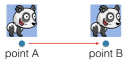
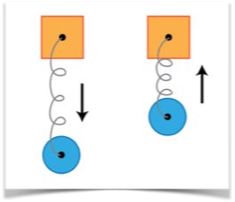
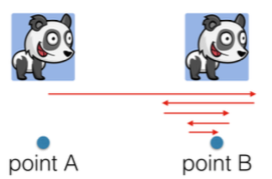
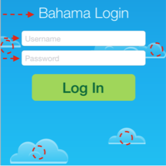

# 第二章：弹簧效果
在之前的章节中，你已经学会用UIKit创建基本的动画效果。比如设置一个起始和结束属性值，UIKit就可以自动的为你添加上动画效果。

到目前为止，你的动画还都只局限于单向的移动，从位置A径直移动到位置B，如图所示：

本章，你讲学会如何创建一种类似接在弹簧上面的复杂动画效果，效果如下图：

如果在从A点移动到B点的基本动画的基础上增加一些弹簧效果，使得动效如果下图中红色箭头指示的一样：

效果中，View从A点径直移动到B点，但是到达B点后却并没有停下来，而是越过去了，然后又回弹，接着又超过B点，反复几次后最终停在B点。

这个是个非常靓的效果，他为你的动画增加了生动的现实生活中的效果，本章将会向你展示如何用这些效果来装饰你的UI。

## 弹簧动画
我们还是从前一章中的例子工程开始，如果你还没有完成第一章中的习题（包括最后的挑战题目），也可以使用资源文件夹中的第二章的开始（译者注：BahamaAir-Starter目录）工程开始学习。

构建并运行，你将看到下面的截图（除了登录按钮）中动画的显示一样：

请将注意力放在最后一个没有添加动画的元素上：登录按钮。

打开“ ViewController.swift”文件，然后在`viewWillAppear()`添加如下两行代码：

	loginButton.center.y += 30.0 
	loginButton.alpha = 0.0
	
就和在之前一章做的一样，想将按钮的起始位置的纵坐标设置的低一点，然后将其alpha值设置为0，从而在一开始的时候不可见。

然后在`viewDidAppear()`里面添加如下代码：

	UIView.animateWithDuration(0.5, delay: 0.5, 
	usingSpringWithDamping: 0.5, initialSpringVelocity: 0.0, 
	options: [], animations: {
		self.loginButton.center.y -= 30.0
		self.loginButton.alpha = 1.0 
	
	}, completion: nil)

注意这段代码中的两个点：


首先，显而易见的这里一下为两个属性添加了动画效果；其次这里用来一个特别长的添加动画的方法 `animateWithDuration(_:delay:usingSpringWithDamping:initialSpringVelocity:opti ons:animations:completion:)`
.

上面的方法和之前用的方法十分类似，但是增加了几个带有运动效果的参数：

* 